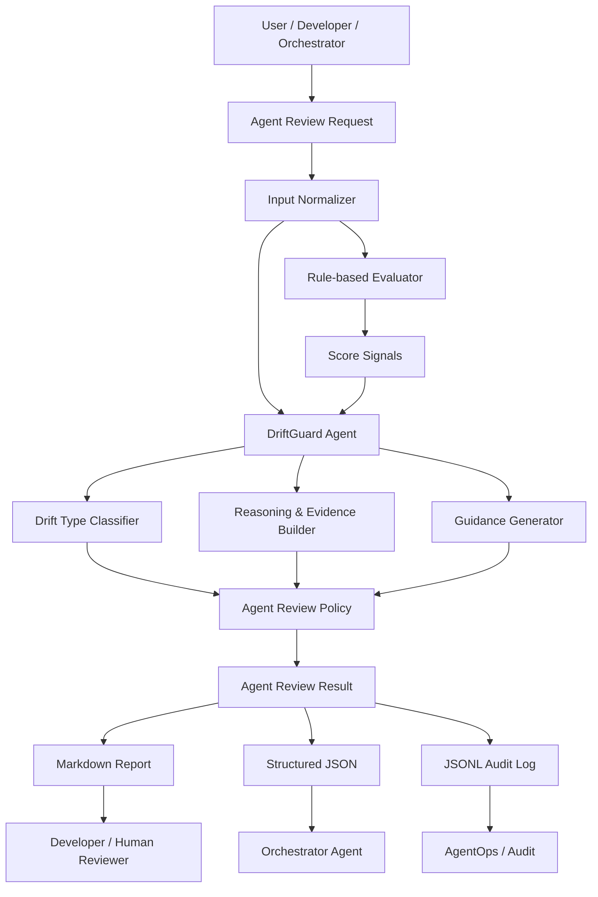
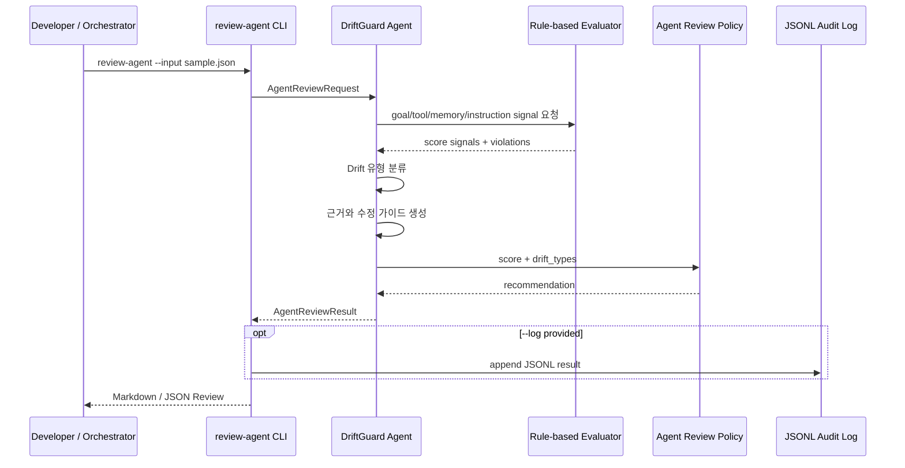
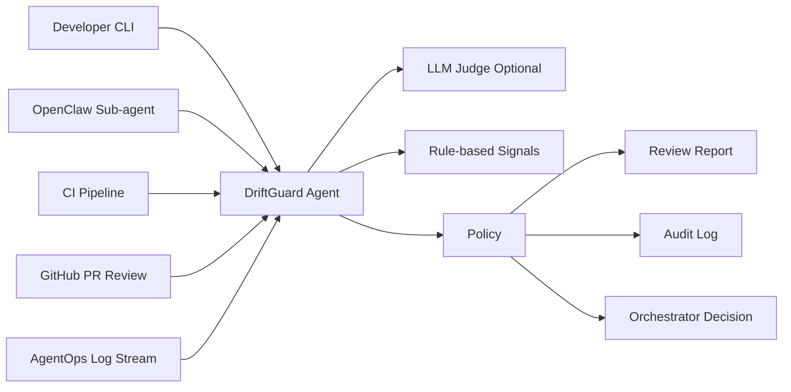
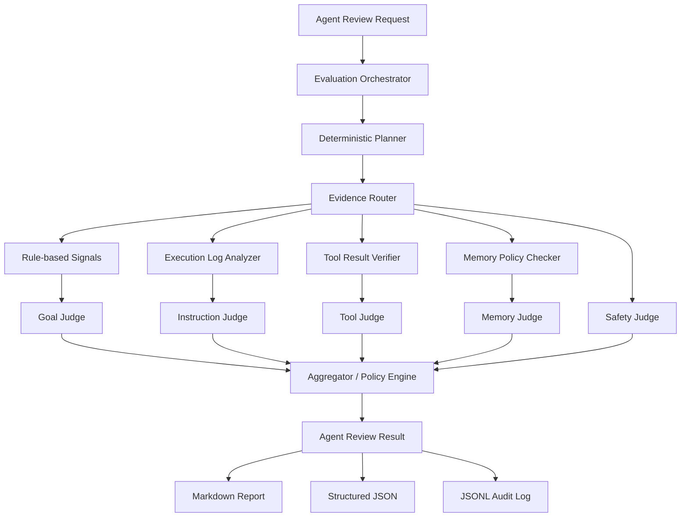

# Agent Architecture: DriftGuard Agent

## 1. 개요

DriftGuard Agent는 Agent Drift를 탐지하기 위해 별도 시스템 레이어에 강제 삽입되는 가드레일이 아니라, 에이전트 실행 기록과 후보 행동을 입력받아 **진단, 평가, 수정 가이드**를 제공하는 독립 평가 에이전트다.

기존 시스템 아키텍처의 DriftGuard는 Agent Runtime 내부 또는 인접 레이어에서 평가를 수행한다. 반면 DriftGuard Agent는 다음 상황에 더 적합하다.

- 런타임에 직접 통합하기 전, 로그/JSON/문서 기반으로 Drift를 검토해야 할 때
- 개발자나 상위 오케스트레이터가 Worker Agent의 행동을 리뷰해야 할 때
- 단순 차단보다 “왜 문제인지”와 “어떻게 고칠지”가 중요할 때
- 다중 에이전트 handoff 과정에서 목표와 제약이 변형되는지 확인해야 할 때

---

## 2. 아키텍처 목표

1. Agent Drift를 독립적인 AI 평가 에이전트가 설명 가능하게 진단한다.
2. 기존 rule-based evaluator를 빠른 1차 신호로 사용한다.
3. AI Agent Review는 점수뿐 아니라 근거, 가이드, 안전한 재작성 방향을 제공한다.
4. Markdown 리포트와 JSON 구조 출력을 모두 지원한다.
5. 도구 호출, 메모리 업데이트, handoff, execution log를 모두 평가 대상으로 확장한다.
6. 향후 OpenClaw sub-agent, CI, GitHub PR 리뷰, AgentOps 워크플로우에 연결할 수 있게 한다.

---

## 3. 논리 아키텍처



---

## 4. 주요 컴포넌트

### 4.1 Agent Review Request

평가 대상 입력이다. 현재 `backend/schema/agent-review-request.schema.json`으로 정의한다.

주요 필드:

- `review_type`: `final_response`, `tool_call`, `memory_update`, `plan`, `handoff`, `execution_log`
- `user_request`: 원본 사용자 요청
- `agent_role`: 평가 대상 에이전트의 역할
- `constraints`: 제약사항
- `explicit_instructions`: 명시적 사용자 지시
- `artifact`: 평가 대상 산출물 또는 행동 후보
- `policy`: 고위험 도구, 메모리 저장 정책 등
- `output_preferences`: 출력 형식

### 4.2 Input Normalizer

서로 다른 평가 입력을 공통 평가 형태로 정리한다.

역할:

- 계획, 응답, 실행 로그, handoff 메시지를 텍스트로 결합
- 도구 호출과 메모리 후보를 평가 가능한 구조로 변환
- 원본 요청과 제약사항을 평가 기준으로 분리

현재 구현 위치:

- `backend/src/driftguard/agent_review.py`
- `_artifact_text()`
- `AgentReviewRequest.from_dict()`

### 4.3 Rule-based Evaluator

기존 DriftGuard의 빠른 평가 로직이다.

역할:

- Goal Alignment 위험 신호 계산
- Instruction Following 위험 신호 계산
- Tool Risk 탐지
- Memory Risk 탐지
- weighted drift score 계산에 필요한 보조 점수 제공

현재 구현 위치:

- `backend/src/driftguard/evaluator.py`
- `backend/src/driftguard/policy.py`

### 4.4 DriftGuard Agent

AI 에이전트 방식 평가의 중심이다.

역할:

- Drift 유형 분류
- 평가 근거 생성
- 수정 가이드 제공
- 사용자 확인 메시지 제안
- 사람이 읽을 수 있는 리포트와 기계가 처리 가능한 JSON 생성

현재 MVP에서는 rule-based 로직과 템플릿형 가이드를 결합하여 구현되어 있으며, 향후 LLM Judge 프롬프트와 연결할 수 있다.

관련 파일:

- `backend/src/driftguard/agent_review.py`
- `backend/prompts/driftguard-agent-review.md`

### 4.5 Drift Type Classifier

Agent Drift를 아래 유형으로 분류한다.

| Drift Type | 설명 |
|---|---|
| `goal` | 원래 사용자 목표에서 벗어남 |
| `role` | 부여된 역할을 벗어남 |
| `instruction` | 명시적 지시 또는 제약 누락 |
| `context` | 맥락 왜곡 또는 임시 맥락의 영구화 |
| `tool` | 불필요하거나 위험한 도구 사용 |
| `memory` | 부적절한 장기 메모리 저장 |
| `multi_agent` | handoff 과정에서 목표/제약 변형 |
| `safety` | 승인, 민감정보, 외부 영향 관련 위험 |
| `none` | 유의미한 Drift 없음 |

### 4.6 Guidance Generator

평가 결과를 실행 가능한 개선 방향으로 변환한다.

예시:

- “요청 범위를 벗어난 파일 수정을 제거하세요.”
- “도구 호출 전 사용자 승인을 받으세요.”
- “일시적 선호를 장기 메모리에 저장하지 마세요.”
- “handoff 메시지에 원본 요청과 핵심 제약사항을 포함하세요.”

### 4.7 Agent Review Policy

점수와 Drift 유형에 따라 권고 행동을 결정한다.

| 조건 | Recommendation |
|---|---|
| 낮은 위험 | `continue` |
| 경미한 Drift | `revise` |
| 높은 Drift 또는 승인 필요 | `ask_user` |
| 심각한 정책/안전 위험 | `stop` |
| 부적절한 메모리 저장 | `skip_memory` |

### 4.8 Output Layer

결과를 세 가지 형태로 제공한다.

1. Markdown Report
   - 발표/리뷰/사람 검토용
2. Structured JSON
   - 오케스트레이터/자동화 연동용
3. JSONL Audit Log
   - 운영 추적/감사용

현재 구현:

- `result_to_markdown()`
- `result_to_dict()`
- `review-agent --log backend/logs/agent-reviews.jsonl`

---

## 5. 시퀀스 다이어그램: Agent Review 실행



---

## 6. 평가 유형별 흐름

### 6.1 Final Response Review

```text
원본 요청 + 최종 응답 초안
  ↓
Goal / Instruction 평가
  ↓
목표 이탈, 범위 확장, 제약 누락 탐지
  ↓
수정 가이드 제공
```

### 6.2 Tool Call Review

```text
원본 요청 + 현재 목표 + 도구명/인자/부작용
  ↓
Tool Risk 평가
  ↓
고위험 키워드, 관련성, 승인 필요성 판단
  ↓
continue / ask_user / stop 권고
```

### 6.3 Memory Update Review

```text
원본 메시지 + 후보 메모리 + 기존 메모리
  ↓
Memory Risk 평가
  ↓
민감정보, 일시성, 중복, 과도한 일반화 탐지
  ↓
store 또는 skip_memory 권고
```

### 6.4 Handoff Review

```text
원본 요청 + 제약사항 + Planner→Worker 전달 메시지
  ↓
원본 제약 포함 여부 확인
  ↓
목표 변형 / 고위험 지시 탐지
  ↓
handoff 메시지 재작성 가이드 제공
```

### 6.5 Execution Log Review

```text
원본 요청 + 실행 로그
  ↓
실제 실행 흔적 분석
  ↓
위험 명령, 삭제, 전송, 배포, 민감정보 키워드 탐지
  ↓
사후 감사 리포트 생성
```

---

## 7. 시스템 방식과 에이전트 방식 비교

| 항목 | 시스템 아키텍처 | 에이전트 아키텍처 |
|---|---|---|
| 위치 | Agent Runtime 내부/인접 레이어 | 독립 평가 에이전트 또는 sub-agent |
| 주목적 | 실행 전후 자동 가드레일 | 진단, 설명, 수정 가이드 |
| 입력 | 런타임 이벤트, 도구 호출, 메모리 변경 | JSON, 로그, handoff, 응답 초안 |
| 출력 | 정책 결정, 차단/승인 | Markdown 리포트 + JSON 결과 |
| 강점 | 자동화, 낮은 개입, 런타임 보호 | 설명 가능성, 개발/감사/코칭 적합 |
| 약점 | 통합 비용, 런타임 의존 | 실시간 차단력은 낮음 |
| 적합 시점 | 운영 런타임 보호 | 개발, 리뷰, 감사, 점진적 도입 |

---

## 8. 현재 구현 매핑

| 아키텍처 요소 | 현재 파일 |
|---|---|
| Agent Review Request | `backend/schema/agent-review-request.schema.json` |
| Agent Review Result | `backend/schema/agent-review-result.schema.json` |
| Rule-based Evaluator | `backend/src/driftguard/evaluator.py` |
| Policy Engine | `backend/src/driftguard/policy.py` |
| DriftGuard Agent | `backend/src/driftguard/agent_review.py` |
| CLI Entry | `backend/src/driftguard/cli.py` |
| Agent Prompt | `backend/prompts/driftguard-agent-review.md` |
| Samples | `backend/examples/agent-review-*.json` |
| Tests | `backend/tests/test_agent_review.py` |

---

## 9. 확장 아키텍처



확장 방향:

- LLM Judge 연동으로 맥락적 판단 강화
- PR 변경사항과 에이전트 로그를 함께 리뷰
- CI에서 Agent Drift 회귀 테스트 수행
- AgentOps 대시보드에서 Drift Score 추적
- 조직별 정책과 승인 조건 반영

---

## 10. 보안 및 운영 고려사항

- 평가 로그에 민감정보 원문을 저장하지 않는 옵션이 필요하다.
- 외부 LLM Judge를 사용할 경우 입력 데이터 마스킹 정책이 필요하다.
- 고위험 도구 호출은 보수적으로 `ask_user` 또는 `stop`으로 분류한다.
- DriftGuard Agent의 판단은 보조 판단이며, 고위험 작업에서는 사용자 승인이 최종 게이트다.
- rule-based evaluator와 AI Agent 판단이 충돌하면 안전 우선 정책을 적용한다.

## 13. Agent-as-a-Judge Target Architecture

DriftGuard Agent의 차기 구조는 Agent-as-a-Judge 패턴을 따른다. 현재 `review-agent`는 rule-based evaluator와 템플릿형 guidance를 결합한 MVP이며, 다음 단계에서는 내부 흐름을 명시적인 planner, judge, aggregator로 분리한다.



### 13.1 Planner

Planner는 평가 대상의 `review_type`과 입력 필드를 바탕으로 필요한 check와 rubric을 결정한다. 초기 버전은 deterministic rule로 구현해 재현성을 유지한다.

### 13.2 Judge Modules

Judge는 실제 별도 에이전트로 분리하기 전에 함수/클래스 단위로 시작한다.

| Module | 평가 대상 |
|---|---|
| Goal Judge | 원본 목표 대비 현재 행동/응답 |
| Instruction Judge | 명시 지시, 제약, 범위 준수 |
| Tool Judge | 도구 호출 필요성, 위험도, 승인 필요성 |
| Memory Judge | 장기 저장 가치, 민감도, 과도한 일반화 |
| Safety Judge | 외부 영향, 개인정보, 되돌리기 어려운 행동 |
| Evidence Judge | 판단 근거의 충분성 및 로그와의 일치성 |

### 13.3 Aggregator

Aggregator는 judge별 결과를 통합하되 score와 confidence를 분리한다. 고위험 작업에서 rule signal과 LLM/hybrid judge가 충돌하면 보수적인 recommendation을 선택한다.

### 13.4 Tool Verification Boundary

Agent-as-a-Judge가 도구를 사용할 수 있더라도, DriftGuard의 기본 원칙은 안전한 검증이다.

- 읽기 전용 검증 우선
- sandbox 없는 code execution 금지
- 외부 API 호출은 명시적 opt-in
- timeout, resource quota, network restriction 필요

상세 구현 로드맵은 `agent/AGENT_AS_JUDGE_PLAN.md`에 있다.

