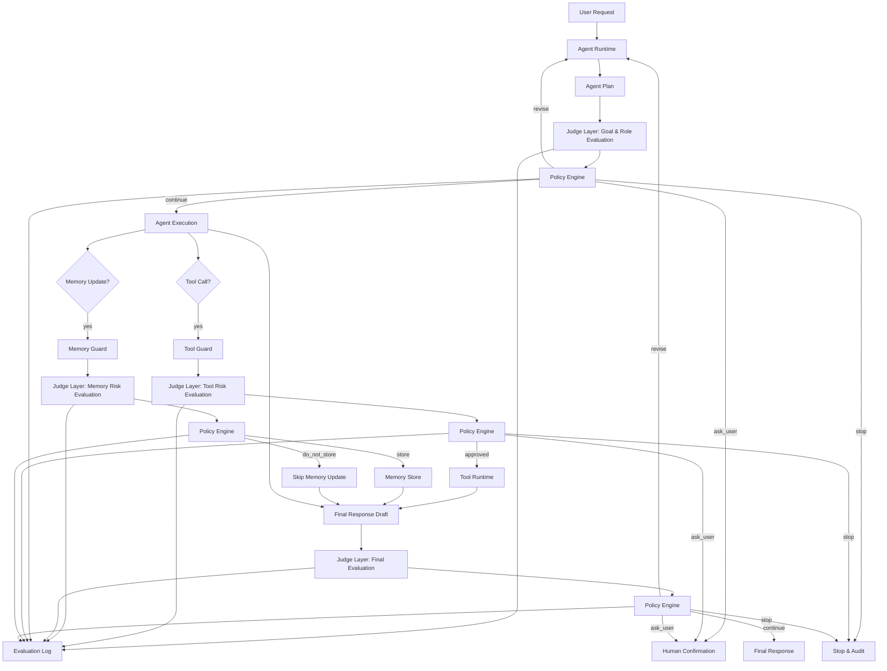
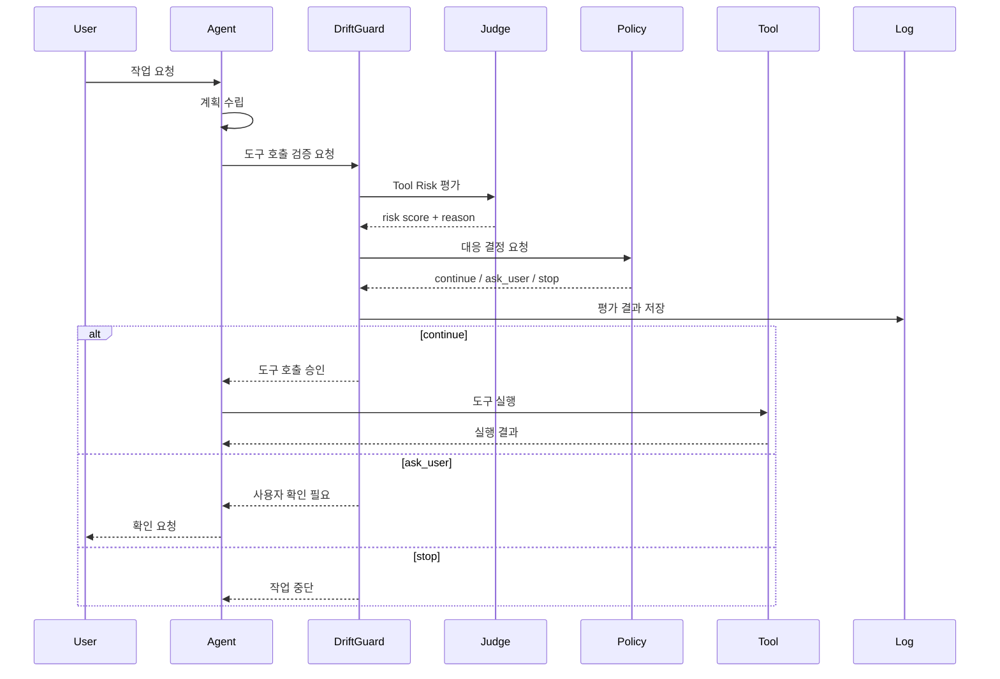

# 시스템 아키텍처: DriftGuard

## 1. 개요

DriftGuard는 AI 에이전트 런타임과 Judge Layer 사이에 위치하는 평가/가드레일 시스템이다.

에이전트가 계획을 세우거나, 도구를 호출하거나, 메모리를 업데이트하거나, 최종 응답을 제출하기 전에 DriftGuard가 평가를 수행한다.

---

## 2. 논리 아키텍처



---

## 3. 컴포넌트 설명

### 3.1 Agent Runtime

사용자 요청을 받아 계획을 수립하고 실행하는 본체다.

책임:

- 사용자 요청 해석
- 작업 계획 생성
- 도구 호출 후보 생성
- 최종 응답 생성

---

### 3.2 Judge Layer

LLM as a Judge를 사용하여 에이전트의 행동과 산출물을 평가한다.

평가 유형:

- Goal Alignment
- Role Consistency
- Instruction Following
- Tool Risk
- Memory Risk
- Final Output Quality

---

### 3.3 Policy Engine

Judge의 평가 결과를 받아 다음 행동을 결정한다.

가능한 결정:

- `continue`
- `revise`
- `ask_user`
- `stop`
- `store_memory`
- `skip_memory`

---

### 3.4 Tool Guard

도구 호출 전후에 위험도를 평가한다.

주요 확인 사항:

- 사용자 요청과의 관련성
- 부작용 여부
- 승인 필요 여부
- 더 안전한 대안 존재 여부

---

### 3.5 Memory Guard

장기 메모리 업데이트 전에 저장 적합성을 평가한다.

주요 확인 사항:

- 장기 저장 가치
- 민감도
- 일시적 정보 여부
- 기존 메모리와의 충돌 여부

---

### 3.6 Evaluation Log

평가와 정책 결정의 감사 추적을 제공한다.

저장 정보:

- 평가 시점
- 평가 대상
- 점수
- 위험도
- 추천 대응
- 실제 대응
- 평가 근거

---

## 4. 시퀀스 다이어그램: 도구 호출 검증



---

## 5. 데이터 모델 초안

### 5.1 EvaluationRequest

```json
{
  "evaluation_type": "goal | instruction | tool | memory | final",
  "user_request": "string",
  "agent_state": {},
  "candidate_action": {},
  "constraints": ["string"],
  "context_summary": "string"
}
```

### 5.2 EvaluationResult

```json
{
  "evaluation_id": "uuid",
  "scores": {
    "goal_alignment": 0.0,
    "instruction_following": 0.0,
    "tool_risk": 0.0,
    "memory_risk": 0.0,
    "overall_drift": 0.0
  },
  "risk_level": "low | medium | high | critical",
  "recommendation": "continue | revise | ask_user | stop",
  "reason": "string",
  "violations": ["string"]
}
```

---

## 6. 배포 형태 후보

### 6.1 라이브러리 형태

에이전트 런타임 내부에서 SDK처럼 호출한다.

장점:

- 통합이 간단함
- 지연 시간이 낮음
- 상태 접근이 쉬움

단점:

- 언어/런타임별 구현 필요

### 6.2 사이드카 서비스 형태

DriftGuard를 별도 API 서버로 운영한다.

장점:

- 여러 에이전트가 공통 사용 가능
- 중앙 정책 관리 가능
- 로그 수집이 쉬움

단점:

- 네트워크 지연 증가
- 인증/권한 관리 필요

### 6.3 권장 MVP

초기 MVP는 **라이브러리 형태**로 구현하고, 이후 사이드카 서비스로 확장하는 방식을 권장한다.

---

## 7. 보안 고려사항

- Judge 입력에 민감정보가 포함될 수 있으므로 마스킹 정책이 필요하다.
- 평가 로그에는 원문 대신 해시 또는 요약을 저장할 수 있어야 한다.
- 고위험 도구는 fail-closed 정책을 기본값으로 한다.
- 외부 LLM Judge 사용 시 데이터 전송 정책을 명확히 해야 한다.
